# Création des projets

Créer un répertoire nommé "phonegap-sencha" à l'endroit où vous voulez stocker vos projets.


## Création du projet Android

### Prérequis
 * Avoir l'environnement Android installé et à jour
 * Avoir la dernière version d'intellJ Idea
 * Avoir télécharger phonegap

### étapes

 * Créer un projet Android comme suit:
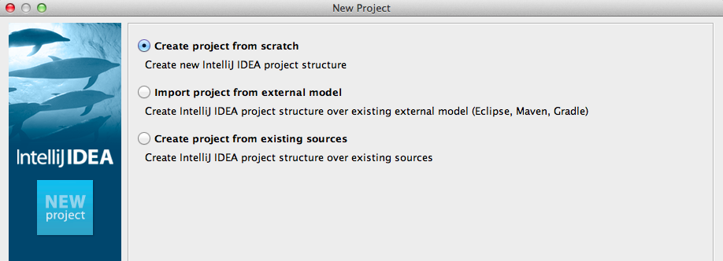

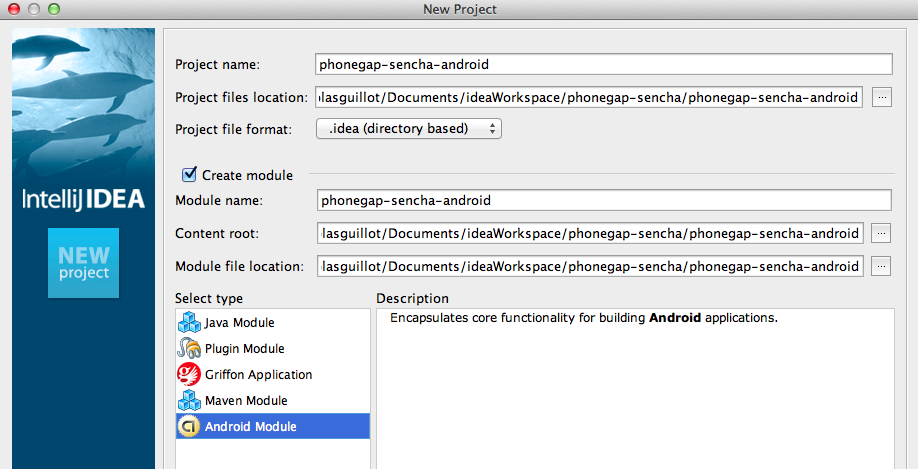

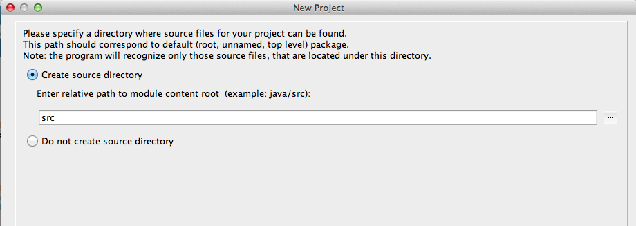

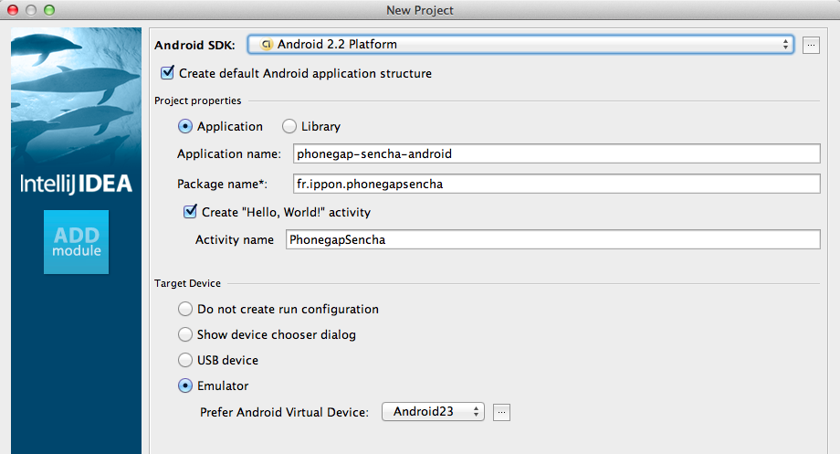

 * s'ils n'existent pas créer les répertoires
    * /libs
    * /assets/www

 * copier le fichier cordova-2.1.0.js dans le répertoire /assets/www/
 * copier le fichier cordova-2.1.0.jar dans le répertoire /libs
 * créer le fichier /assets/www/main.js

```
var isReady = function() {
    document.getElementById("isReady").innerHTML = "is ready";
    document.getElementById("platform").innerHTML = device.platform;
    document.getElementById("version").innerHTML = device.version;
    document.getElementById("name").innerHTML = device.name;
    document.getElementById("width").innerHTML = screen.width;
    document.getElementById("height").innerHTML = screen.height;
};

var getLocation = function() {
    var suc = function(p) {
        alert(p.coords.latitude + " " + p.coords.longitude);
    };
    var locFail = function() {
    };
    navigator.geolocation.getCurrentPosition(suc, locFail);
};

function check_network() {
    var networkState = navigator.network.connection.type;

    var states = {};
    states[Connection.UNKNOWN]  = 'Unknown connection';
    states[Connection.ETHERNET] = 'Ethernet connection';
    states[Connection.WIFI]     = 'WiFi connection';
    states[Connection.CELL_2G]  = 'Cell 2G connection';
    states[Connection.CELL_3G]  = 'Cell 3G connection';
    states[Connection.CELL_4G]  = 'Cell 4G connection';
    states[Connection.NONE]     = 'No network connection';

    confirm('Connection type:\n ' + states[networkState]);
}

function init() {
    // the next line makes it impossible to see Contacts on the HTC Evo since it
    // doesn't have a scroll button
    // document.addEventListener("touchmove", preventBehavior, false);
    document.addEventListener("deviceready", isReady, true);
}
```

 * créer le fichier /assets/www/index.html:
```
<html>
  <head>
    <meta name="viewport" content="width=320; user-scalable=no" />
    <meta http-equiv="Content-type" content="text/html; charset=utf-8">
    <title>PhoneGap</title>
      <link rel="stylesheet" href="master.css" type="text/css" media="screen" title="no title">
      <script type="text/javascript" charset="utf-8" src="cordova-2.1.0.js"></script>
      <script type="text/javascript" charset="utf-8" src="main.js"></script>

  </head>
  <body onload="init();" id="stage" class="theme">
    <h1>Welcome to Cordova!</h1>
    <h2>this file is located at assets/www/index.html</h2>
    <div id="info">
        <h4>Plateform is ready: <span id="isReady"> &nbsp;</span></h4>
        <h4>Platform: <span id="platform"> &nbsp;</span>,   Version: <span id="version">&nbsp;</span></h4>
        <h4>Name: <span id="name">&nbsp;</span></h4>
        <h4>Width: <span id="width"> &nbsp;</span>,   Height: <span id="height">&nbsp;</span></h4>
     </div>
    <a href="#" class="btn large" onclick="getLocation();">Get Location</a>
    <a href="#" class="btn large" onclick="check_network();return false;">Check Network</a>
  </body>
</html>
```

 * créer le fichier res/xml/config.xml:

```
<cordova>
    <access origin="http://127.0.0.1*"/> <!-- allow local pages -->
    <log level="DEBUG"/>
    <preference name="useBrowserHistory" value="false" />
<plugins>
    <plugin name="App" value="org.apache.cordova.App"/>
    <plugin name="Geolocation" value="org.apache.cordova.GeoBroker"/>
    <plugin name="Device" value="org.apache.cordova.Device"/>
    <plugin name="File" value="org.apache.cordova.FileUtils"/>
    <plugin name="NetworkStatus" value="org.apache.cordova.NetworkManager"/>
    <plugin name="Notification" value="org.apache.cordova.Notification"/>
    <plugin name="Storage" value="org.apache.cordova.Storage"/>
    <plugin name="Temperature" value="org.apache.cordova.TempListener"/>
    <plugin name="FileTransfer" value="org.apache.cordova.FileTransfer"/>
    <plugin name="Battery" value="org.apache.cordova.BatteryListener"/>
    <plugin name="SplashScreen" value="org.apache.cordova.SplashScreen"/>
</plugins>
</cordova>
```

 Il permet de définir les plugins utilisés par phonegap. Si on a besoin de plus de plugins, il faut les ajouter.

 * ajouter ce jar dans le classpath du projet:

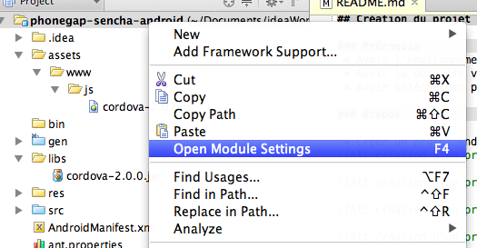

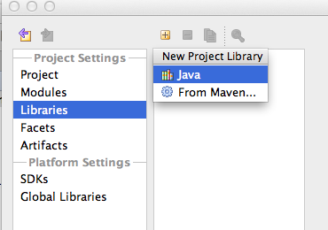

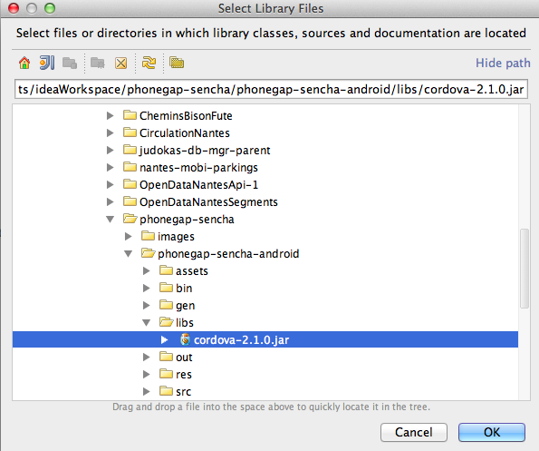

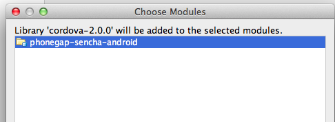

 * modifier l'activité de façon à avoir:

```
package fr.ippon.phonegapsencha;

import android.os.Bundle;
import org.apache.cordova.DroidGap;

public class PhonegapSencha extends DroidGap
{
    /** Called when the activity is first created. */
    @Override
    public void onCreate(Bundle savedInstanceState)
    {
        super.onCreate(savedInstanceState);
        super.loadUrl("file:///android_asset/www/index.html");
    }
}
```

 * modifier le fichier AndroidManifest.xml de façon à avoir

```
<?xml version="1.0" encoding="utf-8"?>
<manifest xmlns:android="http://schemas.android.com/apk/res/android"
          package="fr.ippon.phonegapsencha"
          android:versionCode="1"
          android:versionName="1.0">
    <uses-sdk android:minSdkVersion="8"/>
    <supports-screens
            android:largeScreens="true"
            android:normalScreens="true"
            android:smallScreens="true"
            android:resizeable="true"
            android:anyDensity="true" />
    <uses-permission android:name="android.permission.ACCESS_COARSE_LOCATION" />
    <uses-permission android:name="android.permission.ACCESS_FINE_LOCATION" />
    <uses-permission android:name="android.permission.ACCESS_LOCATION_EXTRA_COMMANDS" />
    <uses-permission android:name="android.permission.READ_PHONE_STATE" />
    <uses-permission android:name="android.permission.INTERNET" />
    <uses-permission android:name="android.permission.WRITE_EXTERNAL_STORAGE" />
    <uses-permission android:name="android.permission.ACCESS_NETWORK_STATE" />
    <uses-permission android:name="android.permission.BROADCAST_STICKY" />

    <application android:label="@string/app_name">
        <activity android:name="PhonegapSencha"
                  android:label="@string/app_name"
                  android:configChanges="orientation|keyboardHidden|keyboard|locale">
            <intent-filter>
                <action android:name="android.intent.action.MAIN"/>
                <category android:name="android.intent.category.LAUNCHER"/>
            </intent-filter>
        </activity>
    </application>
</manifest>
```
 * créé
 * lancer le simulateur, vous devriez obtenir ceci:

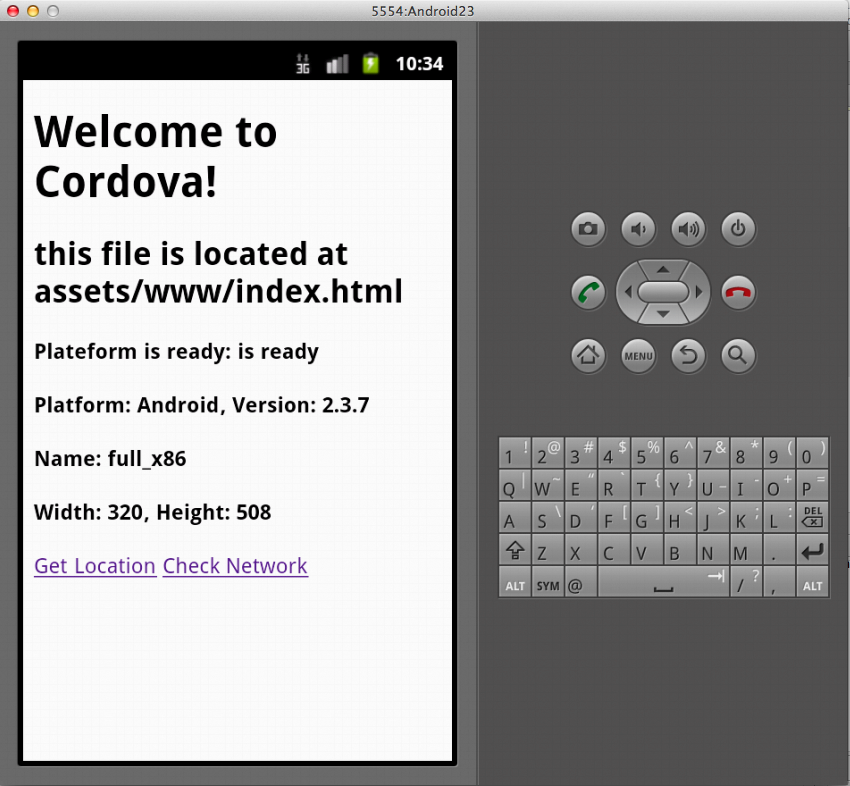

### Source
[Phonegap: Getting Started with Android] (http://docs.phonegap.com/en/2.1.0/guide_getting-started_android_index.md.html#Getting%20Started%20with%20Android)


## Partage sous github

 * créer le fichier .gitignore à la racine avec le contenu suivant:
<pre><code>
*.iml
*.ipr
*.iws
.idea/
local.properties
bin/
target
gen/
.DS_Store
</code></pre>

 * ajouter le projet à github:
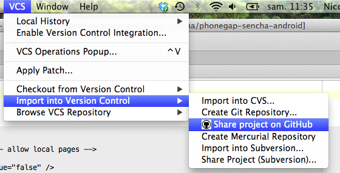

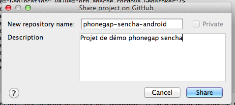

 * le projet est créé sous giithub mais aucun fichier n'est commité, nous allons arranger ça: dans un terminal lancer la commande à la racine du projet:
''' git add . '''

 * remarque ensuite que seul les fichiers n'étant pas dans le gitignore sont ajouté, c'est bien ce que nous voulons:

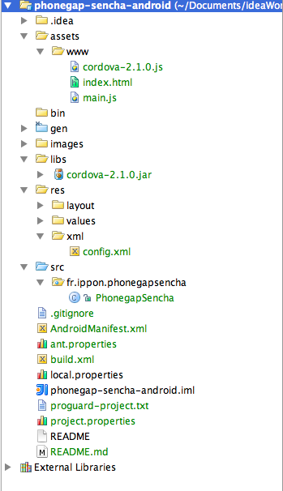


 * nous allons maintenant commiter ces fichiers dans le repository local:

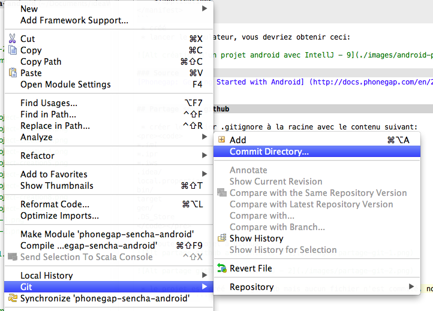

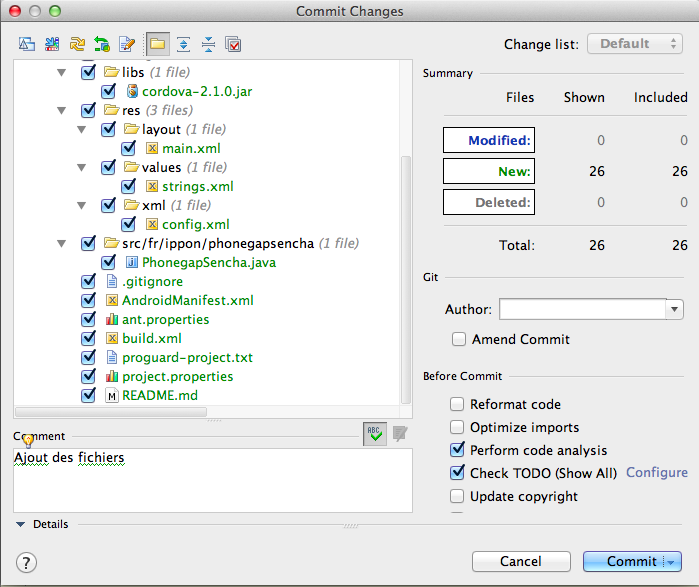

 * il nous reste à pousser ces modifications dans notre github

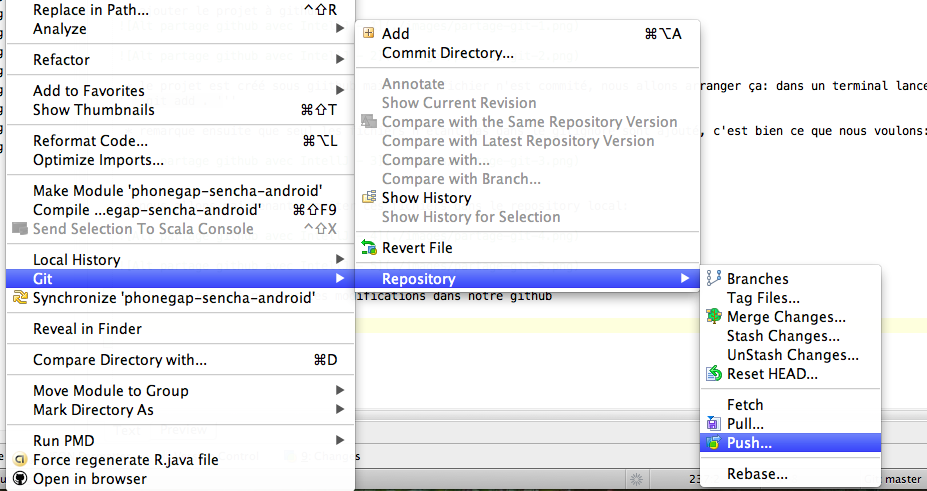

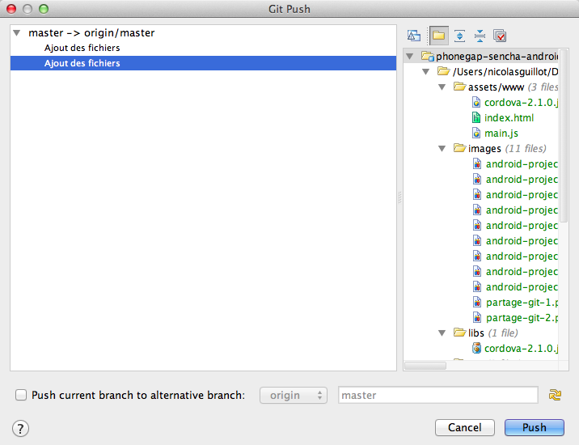

Le dernier écran liste les commit local, on remarque que j'en ai fait un de plus que vous!
